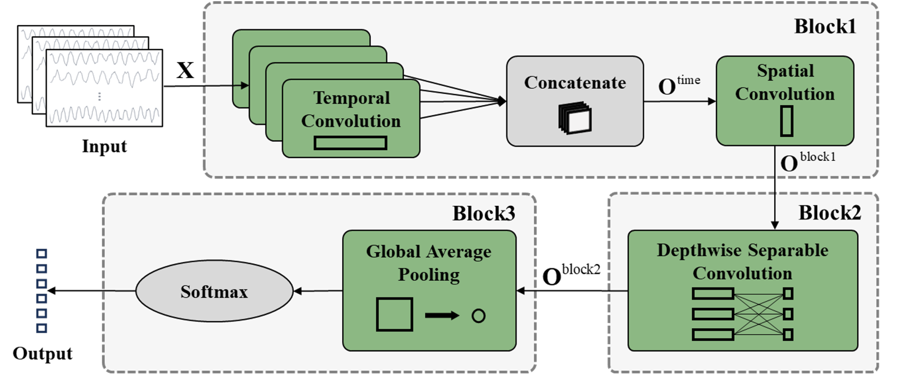

# MTSGNN: Applying SSVEP BCI on Dynamic Background — Example Source Code

This repository provides example source code for the paper **"Applying SSVEP BCI on Dynamic Background"**, including the implementations of **MTSGNN** (Multi-scale Temporal-Spatial Global average pooling Neural Network). The code and data files are organized as follows:

## Repository Structure

- `train.py`  
  The main file for model training and preprocessing. Run with command-line arguments to specify GPU and model type (see below).

- `Models.py`  
  Contains definitions for MTSGNN and several other example neural network models.

- `preprocess.py`  
  Functions for data preprocessing.

- `example_dataset.mat`  
  Example SSVEP EEG dataset.

- `checkpoint/`  
  Records the model weights during model training.

- `results/`  
  Records test accuracy during model training.

## MTSGNN Network Architecture

Below is an overview of the MTSGNN architecture. For a detailed explanation, please refer to our paper.
<figure style="text-align: center;">
  
</figure>

## How to Run

To train a model, use the following command:

```bash
python train.py [GPU_ID] [model_name]
```

Examples:

```bash
python train.py 0 mtsgnn
python train.py 1 eegnetv1
```

- `[GPU_ID]`: ID of the GPU to use for training.
- `[model_name]`: Name of the model to use (see `Models.py`).

## Environment

- python == 3.8.0
- tensorflow-gpu == 2.6.5

It is recommended to use the above environment for best compatibility.

## Data Info

- `example_dataset.mat` contains SSVEP EEG data from subject S1 recorded under the color inversion modulation paradigm.

## Citation

If you use this code or data, please cite the following paper:

> Li J, Fu B, Li F, et al. Applying SSVEP BCI on Dynamic Background[J]. IEEE Transactions on Neural Systems and Rehabilitation Engineering, 2025.

---

For any questions or issues, please open an issue or contact the author.

